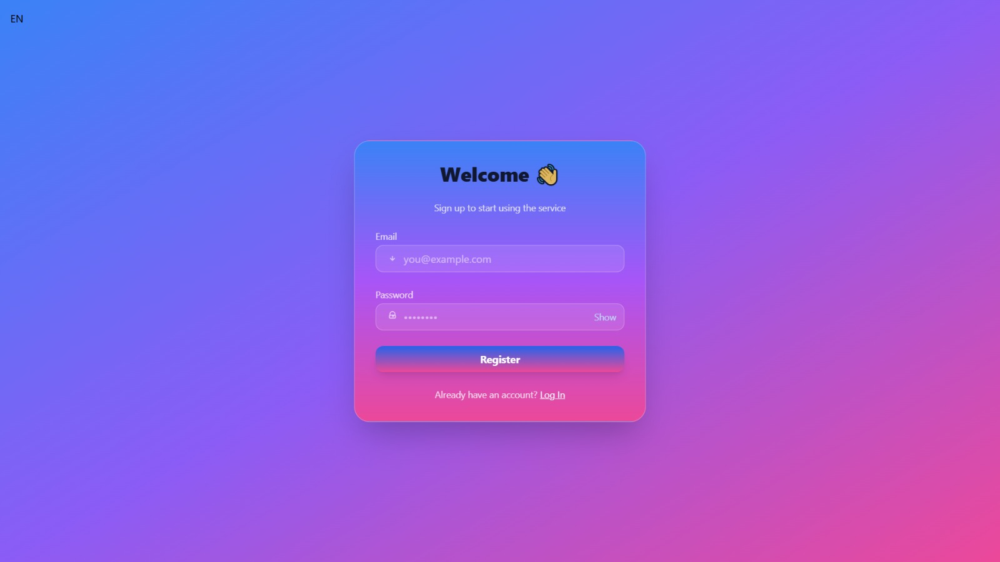
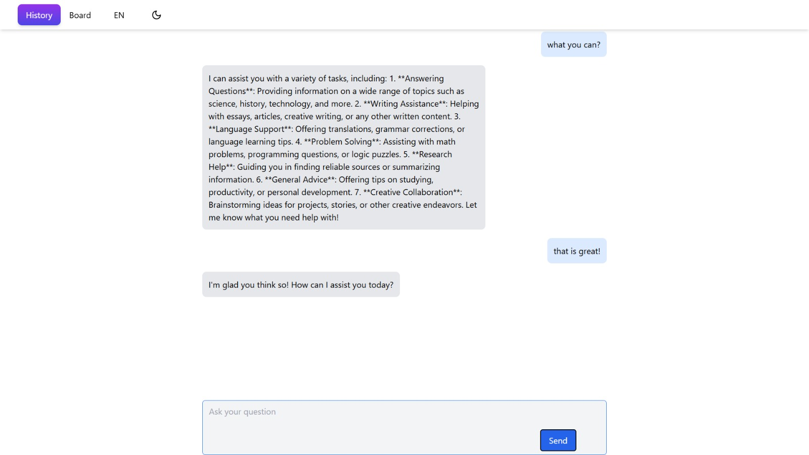
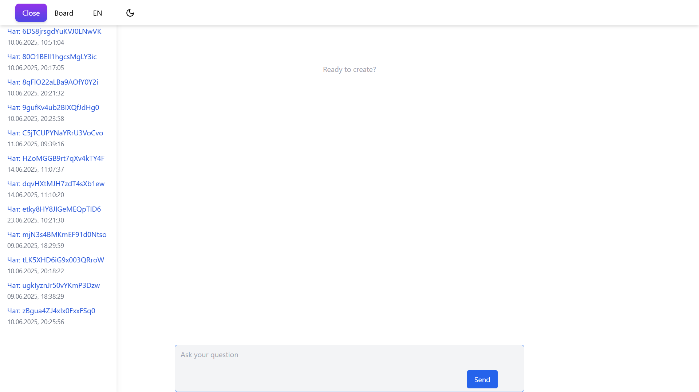
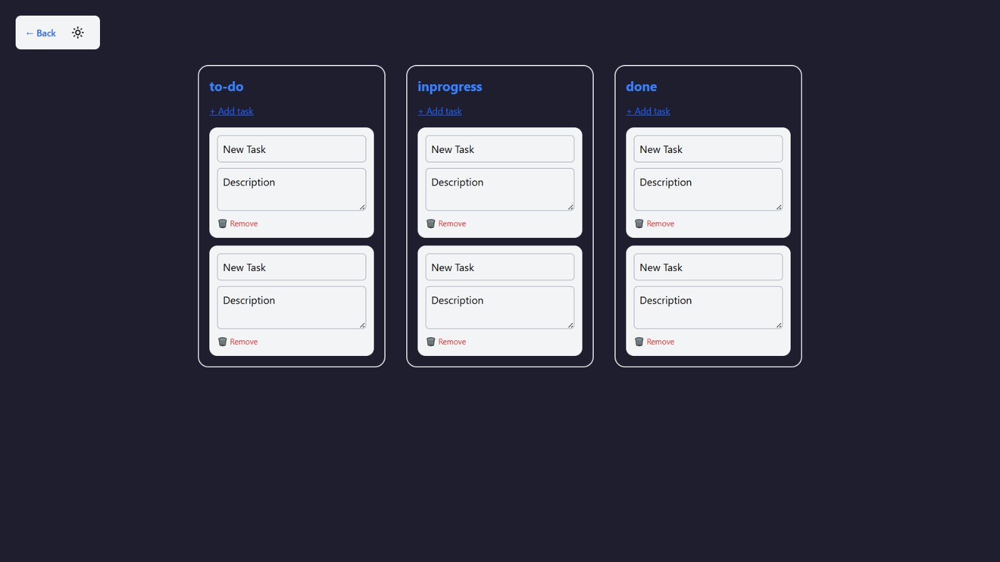

# 🧠 ChatGPT Clone — React + Firebase + OpenRouter API

An AI chat application inspired by ChatGPT. It stores chat history in Firebase, supports theme switching, and uses the OpenRouter API for AI responses.

## 🚀 Tech Stack

🔵 React + TypeScript + Vite

🎨 Tailwind CSS

🔥 Firebase (Auth + Firestore)

🌐 Express.js (Backend)

🧠 OpenRouter API (OpenAI alternative)

---

## ✨ Features

💬 Real-time AI chat
🧾 Message history stored in Firestore
📁 Multiple chats with unique IDs
🌗 Dark/Light theme switcher
🌍 Multilingual interface (i18n)
🔑 Email/password authentication
🎯 Clean and simple project structure

---

## 🖼️ Screenshots

###  📋 Register



###  ❓ AI-Response



### 💬 Chat



### 🗂️ Trello-board



---

# Install dependencies
npm install

# Run client
npm run dev

# Run server
cd server
npm install
node index.js
```
### Vercel - https://vercel.com/sergey-korobovs-projects/ai-task-hub
